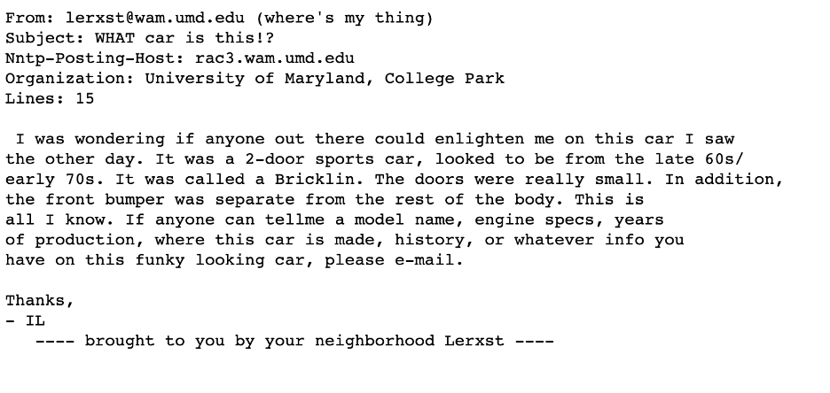
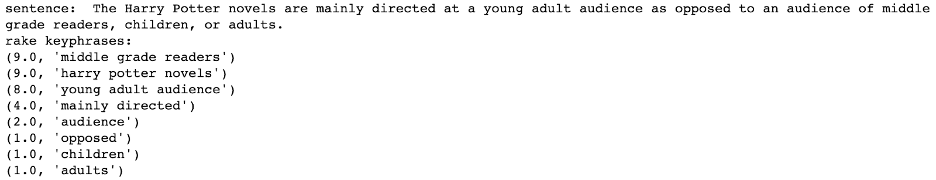
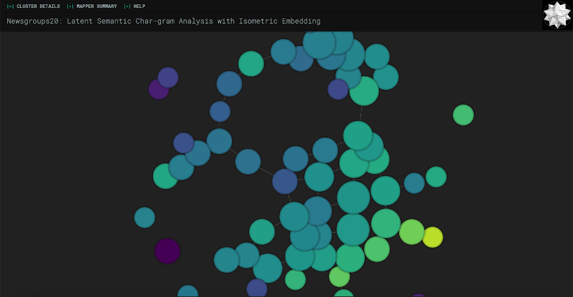

layout: page
title: "How to Extract Keyphrases and Visualize Text"
date: 2020-08-07 10:30:00 -0000
categories: KEYPHRASE-EXTRACTION VISUALIZATION TEXT NLP PYTHON JAVASCRIPT KEPPLER-MAPPER D3

<h1> How to Extract Keyphrases and Visualize Text using Python, JavaScript, Keppler Mapper, d3</h1>

By Cheyenne Zhang

<i>The end product of following this article on the 20 newsgroup dataset. Clusters represent related phrases, and each cluster is labeled with a representative phrase.</i>

### INTRODUCTION

Imagine that you’ve just gotten a huge dataset; for example, the [20 newsgroup dataset](http://qwone.com/~jason/20Newsgroups/), which has 11,314 entries, an example of which is shown below. What would you do to try to understand the data as a whole? Maybe you would look at some entries and their categorization. Maybe you would search the dataset for certain keywords or topics.

<i>The first entry in the newsgroup20 dataset.</i>
 

These approaches will take reading through a large amount of data—maybe even the whole dataset—to gain an understanding of what is going on. However, if we were somehow able to find a way to visualize it, perhaps that might allow us to condense meaning into something we can view in a short amount of time. That’s the goal of the visualization approach—to provide information at a glance, as well as new ways of interacting with this information.

In this article, we’ll see some quick but successful ways to extract meaningful keyphrases from text and how we can use that to produce helpful visualizations.

### MOTIVATION
Over the course of about four weeks during my internship at NLMatics, I worked on creating a visualization of search results from the NLMatics engine. Currently, asking a question to our system provides a textual list of possible answers. While this is very useful in many cases, there is an opportunity to add another lens through which to view information by displaying it in a more intuitive manner, and to guide the user to see what is important about this particular document. With visualization, there are so many possibilities for expressing connections and relationships among the data--color-coding, relative size, text labels, link lengths, link colors...the list goes on! We’ll explore some of these ideas throughout this article.

In this piece, I’ll walk through a simplified version of the process I went through and also some of what I learned from this project. There are two main steps: Keyphrase Extraction, i.e. getting the most meaningful phrases from our text, and then Visualization, which involves clustering based on those phrases and displaying these clusters in an aesthetically appealing manner. If you just want to see the final product, I have set up a [repository](https://github.com/cznlm/visualize-keyphrases) that you can just download and run. It provides a notebook with all of the code from the both steps as well as the modified kmapper code from the Visualization section.

### KEYPHRASE EXTRACTION
#### INTRO. TO RAKE AND YAKE
Keyphrase extraction is not an easy task for a computer; it’s not even easy for humans! Take this sentence from the [Harry Potter Wikipedia page](https://en.wikipedia.org/wiki/Harry_Potter) for example:

“The central character in the series is Harry Potter, a boy who lives in the fictional town of Little Whinging, Surrey with his aunt, uncle, and cousin.”
 

What are the important keyphrases here? Are they the proper nouns—“Harry Potter” and “Little Whinging, Surrey”? Or are they people—“boy,” “aunt,” “uncle,” and “cousin”? Or are the book-related terms most important—”central character”, “series”, “fictional”? As you can see, there are many different interpretations of what makes a keyphrase “meaningful,” even to human judgement. This makes keyphrase extraction a very interesting area of NLP research. [This paper](https://arxiv.org/pdf/1905.05044.pdf), published in July 2019, provides a very thorough overview of the unsupervised and supervised methods currently in the field. Additionally, [this paper](https://www.aclweb.org/anthology/P14-1119.pdf) from 2014 is also a very prominent literature review, if a bit outdated.

For this demonstration, we will focus on a couple of automatic methods (i.e. no training of a model required), namely [RAKE](https://www.researchgate.net/profile/Stuart_Rose/publication/227988510_Automatic_Keyword_Extraction_from_Individual_Documents/links/55071c570cf27e990e04c8bb.pdf) (Rapid Automatic Keyword Extraction) and [YAKE!](https://github.com/LIAAD/yake) (Yet Another Keyphrase Extraction). The reason I chose these two methods is because they are very fast while still producing decent results. At NLMatics, there is often a large number of long documents to be searched by the clients, so speed is most definitely a primary concern. Because of this need for speed and thus the relative simplicity of the algorithms, it is important to note that these methods may cut off phrases in the wrong places, return some not-so-relevant phrases, or miss important phrases entirely, etc. At the end of the day though, I think the speed is worth it!

<i>This is us when we use RAKE and YAKE.</i>
 

Another note is that the reason that we are using both RAKE and YAKE is in the hopes that combining the keyphrases extracted through both of these methods on the same text will provide us with more, higher quality keyphrases. You’ll see below how we will use the keyphrases when clustering sentences based on meaning, but suffice to say that combining the two helps preserve meaning by drowning out the irrelevant ones and increasing the number of relevant ones.

RAKE is a fairly simple algorithm introduced in 2010 that makes use of the observation that good keyphrases rarely include stopwords. First, it uses stopwords and phrase delimiters to split up the text into potential keyphrases. Then, a score is calculated by taking the ratio of degree (defined as the sum of how many times it occurs next to other words in the text) to word frequency for every word in the phrase and summing them to get the phrase’s overall score. Here, I used the [RAKE-NLTK](https://github.com/csurfer/rake-nltk) implementation, which takes advantage of the power of NLTK.

<i>An example of RAKE-extracted keyphrases and their scores. High scores represent high relevance.</i>
 

YAKE is another keyword extraction technique (YAKE literally stands for “Yet Another Keyphrase Extractor”) which makes use of a few more word features to calculate a score. YAKE starts by calculating a score for each individual word using this set of five features: casing (ratio of uppercase and lowercase to overall count), position (favors words near beginning of document), relatedness to context (computes number of terms to the left/right), sentence difference (how often the word appears in different sentences). A sliding window of 3-grams (i.e. three-word-long phrases) is then used to determine the lowest scoring (i.e. most meaningful) possible keyphrases.

<i>An example of YAKE-extracted keyphrases and their scores. Low scores represent high relevance.</i>

#### USING RAKE AND YAKE
I would recommend following along in `notebook.ipynb` from the repository above. Alternatively, you can copy and paste these code blocks into your own new notebook. First, install and import these two libraries:

	!pip install rake_nltk
	!pip install yake
	from rake_nltk import Rake
	import yake

Initialize:

	# Initialize
	r = Rake(min_length=1, max_length=4) # defining min and max length for keyphrases
    y = yake.KeywordExtractor()

There are other parameters you can adjust if you so desire, such as providing your own stopwords for RAKE and n-gram size for YAKE. Check the official [RAKE NLTK usage details](https://csurfer.github.io/rake-nltk/_build/html/advanced.html) and [YAKE documentation](https://github.com/LIAAD/yake#specifying-parameters) for more on those.

Let’s initialize some sample sentences (again from the [Harry Potter Wikipedia page](https://en.wikipedia.org/wiki/Harry_Potter)):

	# Create a list of sample sentences
	sentences = []
	sentences.append("Since the release of the first novel, Harry Potter and the Philosopher's Stone, on 26 June 1997, the books have found immense popularity, critical acclaim and commercial success worldwide.")
	sentences.append("The Harry Potter novels are mainly directed at a young adult audience as opposed to an audience of middle grade readers, children, or adults.")

And use RAKE and YAKE on them!:

    # For each sentence, print the keyphrases that RAKE and YAKE extract
    for sentence in sentences:
	    print("sentence: ", sentence)	 
    r.extract_keywords_from_text(sentence)
    rake_keywords = r.get_ranked_phrases_with_scores()
    print("rake keyphrases: ")
    for kw in rake_keywords:
        print(kw)
    yake_keywords = y.extract_keywords(sentence)
    print("yake keyphrases: ")
    for kw in yake_keywords:
        print(kw)

It’s that simple! As you can see, the keyphrases aren’t perfect. To help get rid of some of the noise, we’re going to set a cutoff. You can play around with the number more if you’d like, but I decided to use 3 as a cutoff for RAKE and 0.4 for YAKE. We’ll also define a function that returns a list of the phrases rather than just printing them out for this so that we can use it later:

	# Define a function which takes in text and returns a list of keyphrases
	def get_keyphrases(text):
	    # yake has some trouble dealing with empty strings
	    if text.strip() == "":
             return [""]

      r.extract_keywords_from_text(text)
      rake_keywords = r.get_ranked_phrases_with_scores()
      yake_keywords = y.extract_keywords(text)
      keyphrases = []
      for kw in rake_keywords:
          if kw[0] > 3:
              keyphrases.append(kw[1])
      for kw in yake_keywords:
          if kw[0] < 0.4:
              keyphrases.append(kw[1])
      return list(set(keyphrases)) # to remove duplicates

A bit better! There are still some inconsistencies that we would be able to fix up with different heuristics, but for now, I think that the keyphrases give an acceptable overview of our example text.

### VISUALIZATION
#### KEPPLER MAPPER WITHOUT MODIFICATIONS

Next, we’ll move onto visualization of these extracted keyphrases. We’ll be using [Kepler Mapper](https://kepler-mapper.scikit-tda.org/), a scikit library that provides the functionality to project data visually, to cluster it, and to create connections between it. This project is inspired by [this Kepler Mapper & NLP example](https://kepler-mapper.scikit-tda.org/notebooks/KeplerMapper-Newsgroup20-Pipeline.html).

First, we’ll run Keppler Mapper without modifications. Note that if you are following along using the code in the repository above, since everything in there is already modified, running it will give you the final product and not these intermittent steps I will be talking about. But I have included screenshots every so often so hopefully, that will help clear up what each step does.

There will be a lot of steps and it is not necessary to know all the intricate details of each one, but understanding them at a high level will be helpful. Basically, we first need to project the data down into two dimensions so that it can be seen with the human eye on a screen. Then, we cluster it to create our nodes of varying sizes that represent an area of related data. Finally, we label the nodes with the appropriate identifying label.

First, you’ll have to [download Kepler Mapper from source](https://github.com/scikit-tda/kepler-mapper), since we’ll be modifying some of the code for our purposes. Clone into your working directory:

	git clone https://github.com/MLWave/kepler-mapper

You now have the Kepler Mapper code locally, so we can go in and modify it later. But first, we’ll run an example of what a normal Kepler Mapper visualization would look like without modifications to the frontend, and then we’ll adapt it for our purposes.

As mentioned above, we’ll be using the [20 newsgroup dataset](https://scikit-learn.org/stable/modules/generated/sklearn.datasets.fetch_20newsgroups.html#sklearn.datasets.fetch_20newsgroups), which scikit conveniently provides.

	# Imports
	import kmapper as km
	import numpy as np
	!pip install scikit-learn
    from sklearn.datasets import fetch_20newsgroups

Make sure to move the `kepler-mapper/kmapper` folder (you won’t need any other folders from the repository besides this one) to the same directory as your `notebook.ipynb` so that your `import kmapper as km` statement can find it.

    # Get the 20newsgroup dataset
    newsgroups = fetch_20newsgroups(subset='train')
    raw_data = newsgroups.data
    X, category, category_names = np.array(raw_data), np.array(newsgroups.target), np.array(newsgroups.target_names)
    print("SAMPLE ENTRY: ", X[0])
    print("SHAPE: ", X.shape)
    print("SAMPLE CATEGORY: ", category[0])
    print("SAMPLE CATEGORY NAME: ", category_names[category[0]])

We have extracted 3 lists named X, category, and category_names.

* From the “SAMPLE ENTRY” line, you can see what X, our dataset, looks like--various emails with headers.
* The “SHAPE” line shows that the dataset is quite large, with 11,314 entries.
* The “CATEGORY” is simply an integer ID for each category that is used to index category_names which has the category stored as a string; for example, category 7 is “rec.autos” means that it’s a recreational email about automobiles.

We’ll be using a subset of the entire dataset and cleaning it up a little bit, including removing the header from these emails. Then, we’ll run the `get_keyphrases` function we created above on the data to get our RAKE and YAKE phrases.

	# Format data -- get rid of email headers, new lines and tabs, and then create joined "sentences" for each sentence
    import re
    headers = ["Lines: ", "NNTP-Posting-Host: ", "NNTP Posting Host: "]
    data_formatted = []
    for entry in raw_data[:1000]:
    occurrences = []
    for header in headers:
        occurrences.append(entry.lower().find(header.lower()))
    champ = max(occurrences)
    if champ != -1:
        start = entry.find("\n", champ)
        data_formatted.append(entry[start:])
    else:
        data_formatted.append(entry)
    data_formatted = [re.sub("[\n\t-]", " ",
    entry) for entry in data_formatted]
    extracted_phrases = [get_keyphrases(entry)
    for entry in data_formatted]
        print("SAMPLE EXTRACTED PHRASES: ", extracted_phrases[0])

**Now this is where our keyphrases come in.** We want to preserve as much meaning as possible from the sentence when we project it down into two dimensions and cluster them. In many cases, raw sentences have a lot of junk in them. We can see this even with our example sentence from above:

“<b>The</b> central character <b>in the</b> series <b>is</b> Harry Potter, <b>a</b> boy <b>who</b> lives <b>in the</b> fictional town <b>of</b> Little Whinging, Surrey <b>with his</b> aunt, uncle, <b>and</b> cousin.”

Out of the 27 words in the sentences, 12 of them are stopwords (bolded above). That’s almost half (!!!) of the words that essentially add no meaning to the sentence!

What we’ll do to overcome this is create “sentences” from our extracted keyphrases; i.e. stringing together all of the keyphrases for a given entry. This will emphasize the meaningful bits in it and de-emphasize the not-so-meaningful ones. Let’s use a shorter example; the sentence:

“There is a big black cat.”

 gets the keyphrases:

“big black cat”, “black cat”
 

when passed in to our `get_keyphrases` function above. The joined “sentence” would then become “big black cat black cat,” essentially boiling the sentence down into its core meaning. We will use this for our projections. The below code will print an example from our dataset:

	extracted_phrases_joined = [" ".join(phrase) for phrase in extracted_phrases]
    print("SAMPLE ORIGINAL SENTENCE: ", data_formatted[0])
    print("SAMPLE JOINED SENTENCE: ", extracted_phrases_joined[0])

Then, we’ll start the process of projecting these meaningful “sentences.” We’ll use TfidfVectorizer to convert our documents into a matrix of TF-IDF features, then perform dimensionality reduction with TruncatedSVD and Isomap. Finally, MinMaxScaler scales them to an appropriate size.

    # Project all of the "sentences" down into a 2D representation
    from sklearn.feature_extraction.text import TfidfVectorizer
    from sklearn.decomposition import TruncatedSVD
    from sklearn.manifold import Isomap
    from sklearn.preprocessing import MinMaxScaler

    mapper = km.KeplerMapper(verbose=2)

    projected_X = mapper.fit_transform(np.array(extracted_phrases_joined),
    projection=[TfidfVectorizer(analyzer="char",
                                ngram_range=(1,6),
                                max_df=0.83,
                                min_df=0.05),
                TruncatedSVD(n_components=100,
                             random_state=1729),
                Isomap(n_components=2,
                       n_jobs=-1)],
    scaler=[None, None, MinMaxScaler()])

    print("SHAPE",projected_X.shape)

Now that we have `projected_X`, a list of 2D representations of each of our sentences, we’re going to cluster the sentences. The clustering algorithm is pretty important here, as different algorithms are suited for different purposes; you can learn more about scikit’s different clustering algorithms [here](https://scikit-learn.org/stable/modules/clustering.html). KeplerMapper uses AgglomerativeClustering in their example, but that ends up with a large number of clusters which is hard to look at and visually take in. Feel free to play around with the algorithms to see what best suits your needs, but here we’ll be using [DBSCAN](https://scikit-learn.org/stable/modules/clustering.html#dbscan), which is characterized by uneven clusters and non-flat geometry (i.e. shapes that aren’t just circles or squares). Here’s a comparison of AgglomerativeClustering vs. DBSCAN on our data.

<i>DBSCAN on the newsgroup20 dataset.</i>
 

<i>AgglomerativeClustering on the newsgroup20 dataset.</i>
 

As you can see, I had to zoom out much more to fit all of the points in with the AgglomerativeClustering version. DBSCAN seems to be a lot more manageable for our purposes of wanting to see information at a glance. So here is the DBSCAN clustering code:

	# Cluster the projected data
    from sklearn import cluster
    graph = mapper.map(projected_X, clusterer=cluster.DBSCAN(eps=0.5, min_samples=3))

Next, we’re going to get TF-IDF wordgrams (1-3) to help us identify each cluster. Essentially, we’ll find the phrases of one to three words that are not too common but at the same time not too uncommon (hence the `min_df` and `max_df` parameters, representing the cut-offs for document frequency values) and later the Kepler Mapper code will calculate some statistics on it that you’ll see in the side info panel.

    # Get counts of phrases from data (to be used for the label and for cluster statistics)
    vec = TfidfVectorizer(analyzer="word",
                      strip_accents="unicode",
                      stop_words="english",
                      ngram_range=(1,3),
                      max_df=0.97,
                      min_df=0.02)

    interpretable_inverse_X = vec.fit_transform(X).toarray()
    interpretable_inverse_X_names = vec.get_feature_names()

    print("SHAPE", interpretable_inverse_X.shape)
    print("FEATURE NAMES SAMPLE",
    interpretable_inverse_X_names[:400])

Finally, we’ll put it all together by using the `visualize()` function. It will write to the `path_html` filename you provide it. We’ll see our `category_names` in the panel on the left-side, and our nodes will be colored according to their categories.

    # Visualize data!
    html = mapper.visualize(graph,
                        X=interpretable_inverse_X,
                        X_names=interpretable_inverse_X_names,
                        path_html="newsgroups20.html",
                        lens=projected_X,
                        lens_names=["ISOMAP1", "ISOMAP2"],
                        title="Visualizing Text - Newsgroup20",                        custom_tooltips=np.array([category_names[ys] for ys in category]),
                        color_function=category)

The very last cell also gives you the option to open the file in the notebook.

	# Open visualization here in the notebook
    from kmapper import jupyter
    jupyter.display(path_html="newsgroups20.html")

That’s it! If you’re following along in the repository, the screenshot below is the outcome of the process so far. If you’re creating your own file from scratch with these code blocks, go ahead and run the whole kernel (it may take a while due to the clustering and projection), and you should see something like this at the bottom. Or, if you prefer, you can open `newgroup20.html` in your web browser:

<i>Default Kepler Mapper on the newsgroup20 dataset using DBSCAN clustering.</i>
 

It already looks really cool! Feel free to play around with it; zoom in and out, open the toggles in the navigation bar, hover on nodes, etc.

#### KEPLER MAPPER WITH MODIFICATIONS

However, one drawback is that you can’t really get much information at a glance from this screen. It’s hard to glean any sort of relationship between the data without knowing what the nodes represent! What we’re going to do next is modify the Kepler Mapper code in the `kmapper` folder so that each node above retains its relative size to other nodes (based on how many members are in the cluster) and also make it big enough so that a defining label for each node can fit.

Please note that the defining label we will be using is the **most common word or phrase** in all of the sentences in that cluster. This generally provides a good label for the cluster as a whole, as opposed to running RAKE or YAKE on the sentences in the cluster which, as I found in my experimentation, tends to focus on one or two entries in the cluster. The sentences in a cluster do have overlap in meaning (that’s why they’re clustered together), but oftentimes it might not be clear enough to simple techniques like RAKE/YAKE why this is so. Generally, these automatic techniques are run on one contained document, not a group of documents. All that is to say, we will be using the most frequent phrase as a label so that we can get an idea of the cluster as a whole.

Navigate to the `kmapper` directory. This is where all of the relevant source code we will be working with is. First, we’ll change the size of the nodes so that they are large enough to hold text. Go into `visuals.py` and find the `_size_node` function in line 406, which is where the size of each node is defined based on how many members are in the cluster. It should look like:

    def _size_node(member_ids):
        return int(np.log(len(member_ids) + 1) + 1)

Change it to:

    def _size_node(member_ids):
        return 35 * int(np.log(len(member_ids) + 1) + 1)

If you were to run again at this point, you would see something like the screenshot below.

<i>Kepler Mapper after adjusting node size.</i>
 

The nodes would appear bigger, but still at a good relative ratio with each other. As you can see, one problem is that there’s some overlap between nodes. We can play around with the forces a bit to try to fix this. If you navigate to line 127, you should see the force settings:

	// Force settings
    var force = d3.layout.force()
            .linkDistance(5)
            .gravity(0.2)
            .charge(-1200)
            .size([w,h]);

For this dataset, I’ve found that changing the [gravity](http://bl.ocks.org/sathomas/191a8a302a363ac6a4b0) from 0.2 to 0.1 and [charge](http://bl.ocks.org/sathomas/1ca23ee9588580d768aa) from -1200 to -1800 repels the clusters enough to mostly get rid of the overlap problem. As a side note, Keppler Mapper actually runs on an outdated version of d3, so I wouldn’t worry too much about understanding the forces because in the most current release, these are basically deprecated anyways and there’s a cool function called [forceManyBody()](https://www.d3indepth.com/force-layout/#forcemanybody) that just gets rid of all overlap! But generally, a negative charge represents more repelling of nodes, and gravity closer to 0 allows the nodes to wander apart further.

Next, we’ll add the label of the top feature, i.e. most common phrase, to each node. Find the format_mapper_data function around line 166, which formats the data to be passed to the HTML template. You can see that each node has this information:

	n = {
            "id": "",
            "name": node_id,
            "color": c,
            "type": t,
            "size": s,
            "tooltip": tt,
        }

We’re going to add a field called `feature` which represents the top occurring feature, and we’ll write this on the node later in the frontend.

	cluster_stats = _format_cluster_statistics(member_ids, X, X_names)
	f = cluster_stats['above'][0]['feature']

    n = {
            "id": "",
            "name": node_id,
            "color": c,
            "type": t,
            "size": s,
            "tooltip": tt,
            "feature": f
        }

`cluster_stats[‘above’]` is a list of the “above-average features”, meaning the features i.e. phrases that occur more than an average amount of times. We’re feeding in the top one to the frontend.

Now, we can go into the JavaScript and make the feature appear. Kepler Mapper was built using [d3](https://d3js.org/), which is a JavaScript library that “helps you bring data to life using HTML, SVG, and CSS.” In terms of this application, it is taking care of a lot of the interactivity, the physics, etc. The creator of d3 has a very thorough [tutorial](https://observablehq.com/collection/@d3/learn-d3) (it’s also interactive!) if you want to learn it from the ground up, but we won’t need to know much about it for this. I would recommend looking into it because you can make some really beautiful visualizations.

At line 194, you’ll see this code:

	// Draw circles
    var circle = node.append("path")
      .attr("d", d3.svg.symbol()
        .size(function(d) { return d.size * 50; })
        .type(function(d) { return d.type; }))
      .attr("class", "circle")
      .style(tocolor, function(d) {
        console.log("Node color:", d.color);
        console.log("becomes color ", color(d.color));
        return color(d.color);
      });

This is the code that creates the visual nodes we see. It gives each a size (note the `d.size * 50`, we’ll make use of that later), a type attribute, a class, and colors it according to the provided color function (the color scheme is [viridis](https://cran.r-project.org/web/packages/viridis/vignettes/intro-to-viridis.html#the-color-scales)). We’ll add code right after this to put text labels on top of this:

	// Add labels
    var label = node.append("text")
        .attr("dy", ".35em")
        .attr("fill", "white")
        .style("font-family", "Roboto")
        .style("font-weight", "300")
        .text(d => d.feature)
        .style("font-size", function(d) {
            var length = this.getComputedTextLength(); // supposedly returns a pixel integer
            var available = Math.pow((d.size * 50 / Math.PI), 0.5) * 2 - 18; // d.size is the squared area
            return (available / length) + "em";
        });

To break this chunk of code down:

* The first line adds text to each node.
* The second centers it vertically; “em” is a unit of measurement which is equal to the point size of the current font, i.e. in size 12 font an em would be 12 pixels. Basically, it centers vertically for your current font size.
* Then we make it white, Roboto, and adjust its weight, i.e. its boldness.
* Then, we add the text itself by returning the property called feature that we just added for each node.
* All that’s left is the font size, which is a bit trickier but nothing crazy. The idea is that we have the size of each node that was passed in from the backend, which when multiplied by 50 (in line 197 if you recall from above, not sure why they designed it this way but it works I suppose) is the area it takes up in pixels, as well as the length of our text label, also in pixels. We then find the diameter of the node, subtract 18 to account for padding from the shadow on the outside of the pixel, then use the ratio of that available diameter to the length of our text as the em value for our font size.

Finally, we have to go up to line 45 and make sure that all text is anchored to the middle, i.e. centered. Change this:

	var svg = d3.select("#canvas").append("svg")
          .attr("width", width)
          .attr("height", height);

To this:

	var svg = d3.select("#canvas").append("svg")
          .attr("width", width)
          .attr("height", height)
          .attr("text-anchor", "middle");

And that’s it! Refresh your kernel and run all cells, and you should get something like this (or just go ahead and run all of them if you’re using my `notebook.ipynb`). A colorful, interactive way of visualizing the most meaningful clusters of your data.

 

<i>Again, here’s the link to a <a href="https://github.com/cznlm/visualize-keyphrases">repository with the relevant code</a> if you wish to download and run directly.</i>

### FURTHER DIRECTIONS
There are a couple of clear directions from here, namely working on reducing noise and experimenting more with/fine-tuning the clustering algorithm. As you can see from the demo GIF, the labels themselves are far from perfect. It would be great to have a representative keyphrase of an entire cluster as opposed to just the top feature. However, it seems that the automatic keyphrase extraction techniques we were using are not suited for this purpose, so looking into perhaps unsupervised and supervised techniques would be a great future direction as well.

### RESOURCES COMPILED
* [20 Newsgroup Dataset](http://qwone.com/~jason/20Newsgroups/)
* [A 2019 Keyphrase Extraction Literature Review](https://arxiv.org/pdf/1905.05044.pdf)
* [A 2014 Keyphrase Extraction Literature Review](https://www.aclweb.org/anthology/P14-1119.pdf)
* [An interesting lecture on keyphrase extraction methods](https://www.youtube.com/watch?v=0DzcUXkn9HY&t=548s)
* [RAKE paper](https://www.researchgate.net/profile/Stuart_Rose/publication/227988510_Automatic_Keyword_Extraction_from_Individual_Documents/links/55071c570cf27e990e04c8bb.pdf)
* [YAKE paper](https://www.researchgate.net/profile/Stuart_Rose/publication/227988510_Automatic_Keyword_Extraction_from_Individual_Documents/links/55071c570cf27e990e04c8bb.pdf)
* [PositionRank, another cool technique that I tried out](https://www.aclweb.org/anthology/P17-1102/)
* [Scikit-learn’s clustering algorithms](https://scikit-learn.org/stable/modules/clustering.html)
* [Keppler Mapper](https://kepler-mapper.scikit-tda.org/)
* [Learn d3 Tutorial Series](https://observablehq.com/collection/@d3/learn-d3)
* [Understanding d3 v3 Forces](http://bl.ocks.org/sathomas/11550728)
* [Understanding d3 v5 Forces](https://www.d3indepth.com/force-layout/)
* [viridis color palettes](https://cran.r-project.org/web/packages/viridis/vignettes/intro-to-viridis.html)
